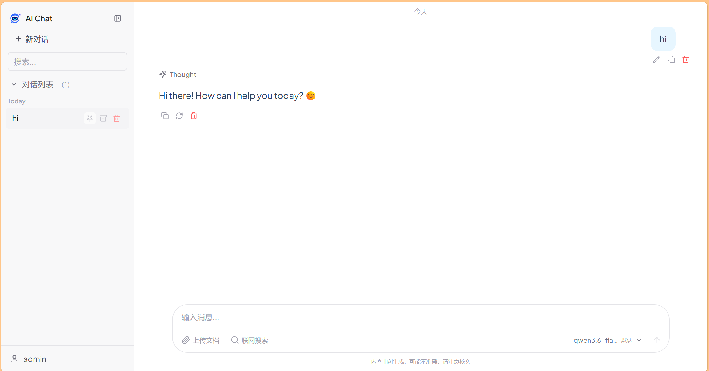

<div align="center">
  <picture>
    <source media="(prefers-color-scheme: dark)" srcset="./logo.svg">
    
  </picture>
  <h1 align="center">AI Chat</h1>
</div>

> 现代化全栈 AI 对话应用 — 类 ChatGPT 体验，支持多模型供应商、联网搜索与文件理解。



## 功能特性

- **多模型供应商** — 支持阿里云 DashScope 和 OpenAI 兼容接口（DeepSeek、通义千问等），用户可自行配置
- **流式输出** — 基于 SSE 的实时流式对话，逐字显示 AI 回复
- **深度思考** — 支持显示模型的推理过程（如 DeepSeek-R1 思维链）
- **联网搜索** — 集成 Tavily API，AI 可参考实时搜索结果回答问题
- **文件理解** — 上传图片、PDF、Office 文档，自动提取文字内容作为上下文
- **对话管理** — 创建/搜索/置顶/归档对话，按时间自动分组
- **消息操作** — 编辑已发消息、重新生成回复、删除消息
- **模型切换** — 对话过程中可随时切换可用模型
- **主题切换** — 亮色/暗色/跟随系统三种主题

## 技术栈

| 层级 | 技术 |
|------|------|
| 前端 | React 19、TypeScript、Vite 6、TailwindCSS 3、Zustand 5 |
| 后端 | Java 17、Spring Boot 3.4、MyBatis-Plus 3.5、MySQL 8 |
| AI | Spring AI Alibaba DashScope、Spring AI OpenAI |
| 安全 | JWT (jjwt)、BCrypt |
| 部署 | Docker、Docker Compose |

## 项目结构

```
ai-chat/
├── ai-chat-backend/           # Spring Boot 后端
│   ├── src/main/java/         # Java 源代码
│   │   ├── controller/        # REST API 控制器
│   │   ├── service/           # 业务逻辑层（含 AI 模型供应商适配）
│   │   ├── entity/            # 数据实体
│   │   ├── mapper/            # MyBatis-Plus 数据映射
│   │   ├── dto/               # 数据传输对象
│   │   ├── config/            # 配置（JWT 过滤、CORS、安全头）
│   │   └── common/            # 通用工具（统一响应、异常处理）
│   ├── sql/init.sql           # 数据库初始化脚本
│   └── docker-compose.yml     # Docker 部署配置
│
├── ai-chat-frontend/          # React 前端
│   └── src/
│       ├── pages/             # 页面组件（Chat、Login、Settings 等）
│       ├── hooks/             # 自定义 Hooks（流式通信、文件上传等）
│       ├── store/             # Zustand 全局状态
│       ├── api/               # HTTP 客户端与 API 封装
│       ├── components/        # 通用组件（代码高亮、主题切换）
│       └── types/             # TypeScript 类型定义
│
├── docs/                      # 文档
├── logo.svg                   # 项目 Logo
└── README.md
```

## 快速开始

### 环境要求

- Java 17+
- Node.js 20+
- MySQL 8.x
- Maven 3.9+（可选）

### 1. 初始化数据库

```bash
mysql -u root -p < ai-chat-backend/sql/init.sql
```

### 2. 配置环境变量

```bash
cp ai-chat-backend/.env.example ai-chat-backend/.env
```

编辑 `ai-chat-backend/.env`，填入真实值：

| 变量 | 说明 | 必填 |
|------|------|------|
| `SPRING_DATASOURCE_URL` | MySQL 连接地址 | 是 |
| `SPRING_DATASOURCE_USERNAME` | 数据库用户名 | 是 |
| `SPRING_DATASOURCE_PASSWORD` | 数据库密码 | 是 |
| `JWT_SECRET` | JWT 签名密钥（`openssl rand -base64 32` 生成） | 是 |
| `SPRING_AI_DASHSCOPE_API_KEY` | 阿里云 DashScope API Key | 是 |
| `TAVILY_API_KEY` | Tavily 搜索 API Key | 否 |
| `APP_DEFAULT_MODEL_PROVIDER` | 默认模型供应商 | 否 |
| `APP_DEFAULT_MODEL_NAME` | 默认模型名称 | 否 |
| `APP_DEFAULT_MODEL_BASE_URL` | 默认模型 API 地址 | 否 |

### 3. 启动后端

```bash
cd ai-chat-backend
mvn spring-boot:run
```

后端默认运行在 `http://localhost:8082`。

### 4. 启动前端

```bash
cd ai-chat-frontend
npm install
npm run dev
```

前端默认运行在 `http://localhost:5173`，Vite 已配置代理将 `/api` 请求转发至后端。

### Docker 部署

```bash
cd ai-chat-backend
# 确保 .env 已正确配置
docker-compose up -d
```

## API 概览

| 方法 | 路径 | 说明 |
|------|------|------|
| POST | `/api/auth/register` | 用户注册 |
| POST | `/api/auth/login` | 用户登录 |
| GET | `/api/conversations` | 获取对话列表 |
| POST | `/api/conversations` | 创建对话 |
| PUT | `/api/conversations/{id}` | 更新对话（标题/系统提示词） |
| DELETE | `/api/conversations/{id}` | 删除对话 |
| PUT | `/api/conversations/{id}/pin` | 切换置顶 |
| PUT | `/api/conversations/{id}/archive` | 切换归档 |
| POST | `/api/chat/stream` | 流式聊天（SSE） |
| GET | `/api/chat/messages/{conversationId}` | 获取消息列表 |
| PUT | `/api/chat/messages/{id}` | 编辑消息 |
| DELETE | `/api/chat/messages/{id}` | 删除消息 |
| POST | `/api/chat/messages/{id}/regenerate` | 重新生成回复（SSE） |
| POST | `/api/files/upload` | 上传文件 |
| GET | `/api/files/{id}` | 查看/下载文件 |
| GET | `/api/model-configs` | 获取用户模型配置 |
| POST | `/api/model-configs` | 保存模型配置 |

## SSE 流式协议

流式聊天接口使用 Server-Sent Events，事件类型如下：

```
event: message      # AI 回复文本片段
event: thinking     # 深度思考过程片段
event: sources      # 联网搜索来源（JSON 数组）
event: done         # 生成完成（含 messageId）
event: error        # 错误信息
```

## License

[MIT](./LICENSE)
